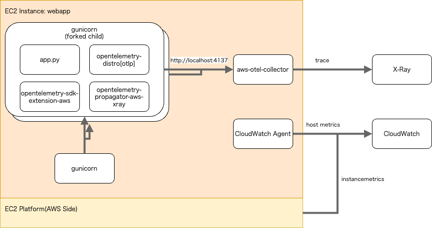

# setup

1. AWSアカウントを用意します
2. `tf/` のREADMEに従ってVPCとインスタンスをセットアップする
3. `ansible/` のREADMEに従ってアプリをセットアップする
4. benchmarkerサーバで、webappサーバのプライベートIPアドレスに向けて、ベンチマーカーが実行できます
    ```
    /home/isucon/private_isu.git/benchmarker/bin/benchmarker -u /home/isucon/private_isu.git/benchmarker/userdata -t http://PRIVATE_IP_ADDRESS
    ```

インスタンス：
- webapp： private-isuの競技者用インスタンス
- benchmarker： priavte-isuのベンチマーカー

# webappインスタンス

## 元AMI（書籍）からの変更点

- Python実装（[methane/pixiv-isucon2016-python](https://github.com/methane/pixiv-isucon2016-python/)）を追加

## 元リポジトリ（[methane/pixiv-isucon2016-python](https://github.com/methane/pixiv-isucon2016-python/)）からの変更点

- OpenTelemetryで計装し `isu-python-adot` サービスを追加
- OpenTelemetryで計装しADOT Collectorとの連携を有効にした `isu-python-adot` サービスをデフォルト起動
- ADOT Collectorを追加
- CloudWatch Agentを追加



※もしADOT（AWS Distro for OpenTelemetry）を利用しない場合は `isu-python` サービスに切り替えてください。

```sh
sudo systemctl stop isu-python-adot
sudo systemctl disable isu-python-adot
sudo systemctl start isu-python
sudo systemctl enable isu-python
```

# 書籍第3章・第4章のk6スクリプト

k6ディレクトリ配下に配置しています。
詳しくは[k6/README.md](k6/README.md)参照。